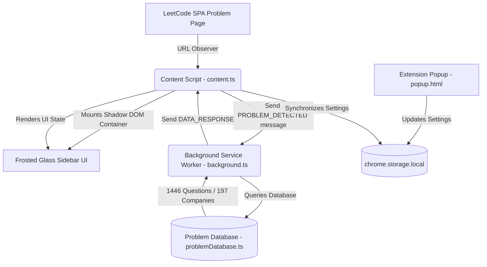

# 🚀 LeetCode Companion Chrome Extension

[](https://developer.chrome.com/docs/extensions/mv3/intro/)
[](https://www.typescriptlang.org/)
[](https://vitejs.dev/)

An intelligent, high-aesthetic interview companion for LeetCode. It injects a responsive, **glassmorphic frosted-glass sidebar** directly into LeetCode problem pages to display similar questions, detailed company frequency metrics, algorithmic patterns, recommendations, and contest history.

It features a dynamically compiled database of **1,446 high-frequency interview questions** asked across **197 top-tier tech companies** (extracted from real-world datasets), complete with keyboard-navigable autocomplete search dropdowns.

---

## ✨ Features Spotlight

### 🔮 Frosted-Glass Sidebar UI
* **Isolated Shadow DOM**: Injected via a secure Shadow Root to guarantee zero stylesheet leakage or conflicts with LeetCode's native styles.
* **Glassmorphism Theme**: Translucent frosted panels with high-blur backdrops (`backdrop-filter: blur(28px)`), subtle borders, and smooth transitions.
* **Vibrant Gradient Headers**: Stylized triple-gradient headers (`#818cf8` Indigo ➔ `#c084fc` Purple ➔ `#f472b6` Pink).
* **Responsive Light & Dark Themes**: Fully automatic theme detection matching LeetCode's UI theme, plus explicit options override.

### 📊 Real-world Company Analytics
* **Interactive Autocomplete**: Search across 197 companies directly in the sidebar or popup with instant matching.
* **Frequency & Recency Metrics**: Transparent color-bar frequency graphs representing how often Meta, Google, Stripe, or Netflix ask each question.
* **Recency Badging**: Identifies if a question was asked within 0-3 months, 3-6 months, or 6-12+ months.

### 🧠 Intricate Recommendations
* **Matching Heuristic**: Scores similar problems using a custom overlap algorithm (pattern resemblance, difficulty delta, and shared tags).
* **Difficulty Pills**: Glowing difficulty badges (Easy, Medium, Hard) colored using vivid HSL palettes.
* **Curated List Identifiers**: Soft badges identifying questions from **Blind 75**, **Neetcode 150**, and **Grind 75**.
* **Solve-Next Engine**: Suggests the optimal progressive step (e.g., matching a related pattern with a slight difficulty curve).

### 🔖 Options & Bookmarking
* **Custom Module Toggle**: Toggle widgets (Similar problems, Predictions, Company Insights, Contest history) on/off.
* **Problem Stars**: Star problems instantly from the sidebar and manage them inside the Chrome Extension Popup dropdown.

---

## 🛠️ Architecture

The following diagram illustrates how the LeetCode Companion Extension modules interact:



---

## 📂 File Directory

```
leetcode-companion/
├── dist/                   # Packaged production extension files
├── public/                 # Static Assets
│   ├── manifest.json       # Extension configuration (Manifest V3)
│   ├── content.css         # Sidebar UI Stylesheet
│   └── icons/              # Programmatically generated icons (16, 48, 128)
├── src/                    # Source Directory
│   ├── types.ts            # Core TypeScript schemas & definitions
│   ├── background.ts       # Background service worker & database lookup
│   ├── content.ts          # Shadow DOM mounting, scraping, and tab controller
│   ├── popup.ts            # Options panel & bookmarks dashboard controller
│   └── data/
│       └── problemDatabase.ts # Aggregated question database
├── scripts/
│   ├── build.js            # Sequential compiler script (prevents vite splitting)
│   ├── build-db.py         # CSV crawler & database compiler script
│   └── generate-icons.py   # Icon maker using Pillow
├── package.json            # npm metadata & dependencies
├── tsconfig.json           # TypeScript configuration
└── vite.config.ts          # Vite bundler configurations
```

---

## 🚀 Installation & Setup

### 1. Build the Extension
Ensure you have [Node.js](https://nodejs.org/) installed, then run the commands below:

```bash
# Install dependencies
npm install

# Compile TypeScript and bundle scripts
npm run build
```
This compiles the TypeScript files and bundles popup, content, and background scripts sequentially into the `/dist` directory.

### 2. Load the Unpacked Extension in Chrome
1. Open **Google Chrome** and navigate to `chrome://extensions/`.
2. Toggle **Developer mode** in the top-right corner.
3. Click **Load unpacked** in the top-left corner.
4. Select the **`dist/`** folder inside the project directory:
   `leetcode-companion/dist`

---

## 💡 How to Use

1. Navigate to any LeetCode problem (e.g., [Two Sum](https://leetcode.com/problems/two-sum/)).
2. Look for the glowing circular button on the bottom right/left of the page.
3. Click the button (or press `Alt + L`) to slide open the frosted glass panel.
4. **Tabs**:
   * **Similar**: Check related problems, matching percentages, and algorithmic rationales.
   * **Companies**: Click company entries to inspect their top-asked questions. Type any company name into the search bar to filter questions asked by specific companies.
   * **Patterns**: View next step recommendations, paired frequency questions, and contest history.
5. **Popup Options**: Click the extension icon in your Chrome toolbar to swap alignment (Left/Right) or manage your bookmarked questions list.

---

## ⚙️ Compiling the Database

The database is pre-compiled. However, if you wish to re-compile it or incorporate fresh CSV data:
1. Clone the reference repository:
   ```bash
   git clone https://github.com/krishnadey30/LeetCode-Questions-CompanyWise.git
   ```
2. Run the compiler script:
   ```bash
   python scripts/build-db.py --csv-dir ./LeetCode-Questions-CompanyWise --out src/data/problemDatabase.ts
   ```
3. Rebuild:
   ```bash
   npm run build
   ```
